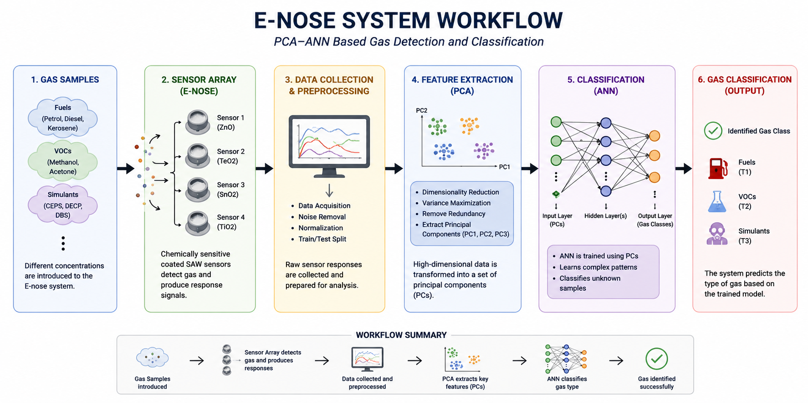
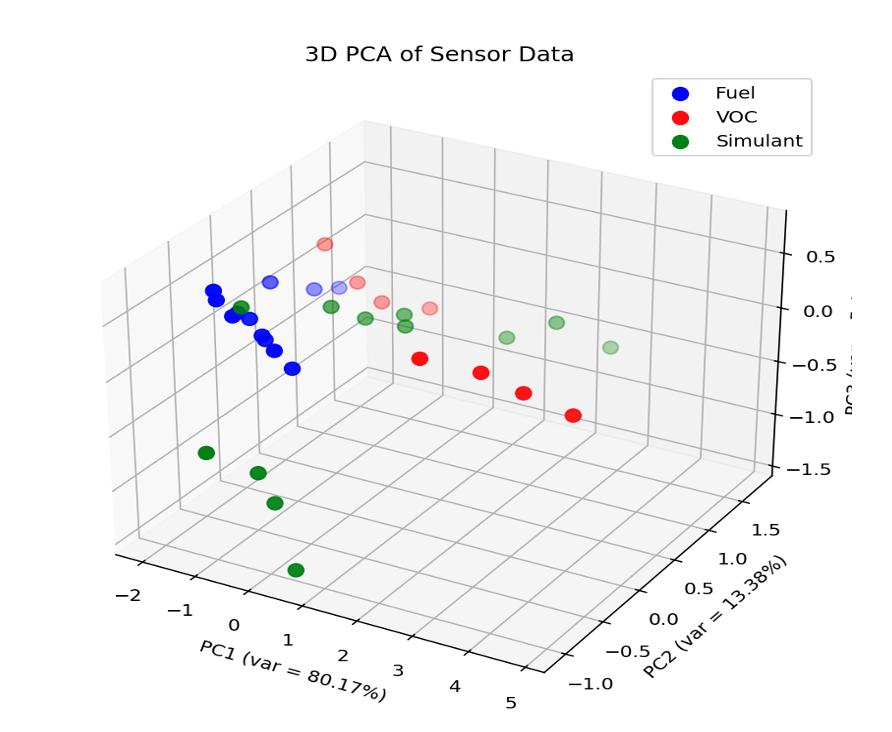
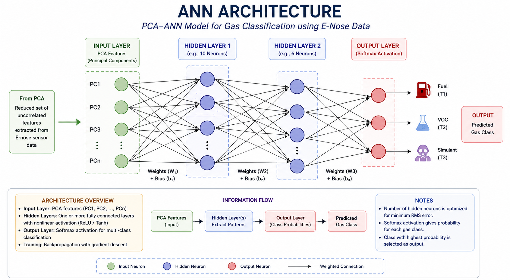
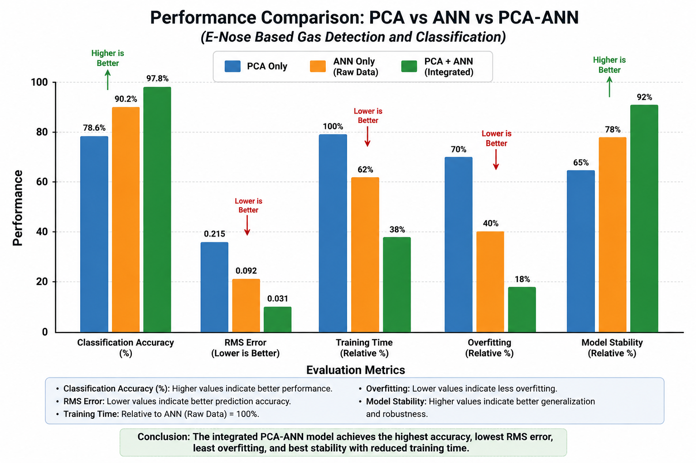

# ANN-Based Electronic Nose for VOC Detection

## Overview
This project explores the use of Artificial Neural Networks (ANN) and Principal Component Analysis (PCA) for the detection and classification of volatile organic compounds (VOCs).

## Objectives
- Develop an AI-driven electronic nose system
- Apply PCA for dimensionality reduction
- Use ANN for pattern recognition and classification

## Tools and Technologies

- Python
- TensorFlow / Keras
- Scikit-learn
- PCA
- Artificial Neural Networks
- Data Visualization
  
## Methodology
1. Data preprocessing
2. PCA feature extraction
3. ANN model training
4. Classification and evaluation

## Future Scope
- Real-time sensor integration
- Improved classification accuracy
- Deployment for environmental monitoring
- ## Repository Structure
- `data/` : Dataset files
- `src/` : Python source code
- `results/` : Graphs and output plots
- `report/` : Project report and presentation

# ANN-Based Electronic Nose for VOC Detection

## Overview

## Objectives

## Methodology

## Workflow Diagram

## PCA Feature Reduction

## ANN Architecture

## Performance Comparison

## Technologies Used

## How to Run

## Future Scope

## Author

## Workflow Diagram



## PCA Feature Reduction



## ANN Architecture



## Performance Comparison



## How to Run

```bash
pip install -r requirements.txt
python src/pca_ann_model.py
```
## Technologies Used

- Python
- TensorFlow / Keras
- Scikit-learn
- PCA
- Artificial Neural Networks
- Pandas
- NumPy
- Matplotlib

## Author

Afreen Chaudhary  
B.Sc. Physics Hons. 
Kalindi College, University of Delhi
